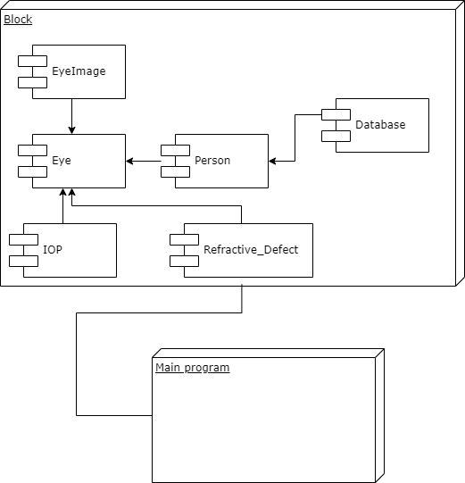

# Maestría en Ciencia de Datos
## Universidad Gabriel René Moreno
### Ing. Marco Zárate

## 1. Introducción
El análisis de datos en el ámbito de la salud ocular ha experimentado un crecimiento significativo gracias a la disponibilidad de conjuntos de datos robustos y a las herramientas de programación como Python, que permiten explorar, visualizar y comprender patrones y tendencias en la información médica. En este contexto, el presente estudio se centra en un análisis detallado de un dataset específico relacionado con enfermedades del ojo, con el objetivo de arrojar luz sobre factores, diagnósticos y posibles correlaciones que pueden ser cruciales para el avance en la investigación oftalmológica.

El dataset seleccionado contiene información variada, con detalles clínicos específicos relacionados con enfermedades oculares.
El problema fundamental son los datos de un dataset sin normalizar, todos en una sola tabla con posibles repeticiones.
El objetivo del proyecto es normalizar los datos mediante técnicas de programación orientada a objetos para hacer más fácil la tarea futura de análisis de estos.

## 2.	Estrategia de modularización
Para la modularización se siguió el siguiente diagrama de clases.

Y los módulos está distribuidos de la siguiente manera.

## 3. Instalación

El código no requiere ninguna instalación para correr en Colab, en caso de querer correrlo de manera local se requiere
1. Visual Studio Code ó
2. Jupyter corriendo localmente

En caso de usar Visual Studio Code se debería instalar la extensión https://marketplace.visualstudio.com/items?itemName=ms-toolsai.jupyter y tener Anaconda corriendo de manera local.

## 4. Puesta en marcha

### Descarga del proyecto
El proyecto puede ser clonado desde el repositorio

    git clone https://github.com/p-kos/mcd_proyectofinal.git

O descargando el zip del mismo desde Github https://github.com/p-kos/mcd_proyectofinal/archive/refs/heads/main.zip

## 5. Visualización de Datos

Para la visualización de datos se puede llamar al método `Get` del Módulo `Database`

    person = db.get(290)
        if person != None:
        person.display()
    

## 6. Inserción de datos

Para la inserción se requiere crear un objecto `Person` y luego llamar a método `insert` del módulo `Database`

    id = db.insert(person=person)

    ## Display the inserted data
    person = db.get(id)
    if person != None:
        person.display()

El método retornará el Id con el que fue creado e insertado, en la base de datos, el nuevo objeto 